<!--
  ============================================================================
  BHARTI AMBULE — GITHUB PROFILE README
  ============================================================================
  SETUP CHECKLIST (read this before anything else):
  1. Create a repo named EXACTLY "codeByBharti" (your GitHub username) if it
     doesn't already exist — GitHub treats this repo specially and renders
     its README.md on your profile page.
  2. Put this file at the root of that repo as README.md.
  3. Upload "orbit-hud.svg" into an "assets/" folder in that same repo, then
     update the  line below to:
     https://raw.githubusercontent.com/codeByBharti/codeByBharti/main/assets/orbit-hud.svg
  4. Add "snake.yml" to ".github/workflows/snake.yml" in that repo to enable
     the animated contribution-snake in the Fun Zone section.
  5. Search this file for "TODO" comments — they mark spots for your photo,
     real project screenshots/GIFs, portfolio link, and Instagram handle.
  ============================================================================
-->

<div align="center">

<!-- ================= BANNER ================= -->


<!-- ================= TYPING ANIMATION ================= -->
<a href="https://github.com/codeByBharti">
  
</a>

<br/>

<!-- ================= VISITOR COUNTER + STATUS ================= -->


<br/><br/>

<!-- ================= SOCIAL BADGES ================= -->
[](https://www.linkedin.com/in/bharti-ambule-8b5436359/)
[](https://github.com/codeByBharti)
[](mailto:bhartiambule156@gmail.com)
<!-- TODO: replace # with your real Instagram profile URL -->
[](#)
<!-- TODO: replace # with your real portfolio website URL -->
[](#)

</div>


<br/>

## 🌐 The HUD — Interactive Control Center

<div align="center">

<!-- Custom lightweight SVG: rotating orbit rings + a constellation of floating
     tech-icon nodes circling a pulsing glowing core. Pure SVG/SMIL animation,
     no JavaScript needed, so it animates natively on GitHub.
     See SETUP step 3 above to make this render from your repo. -->


<p><i>⚡ Continuous orbit motion · neon glow · zero JS overhead ⚡</i></p>

</div>


<br/>

## 🧬 About Me

<table>
<tr>
<td width="58%" valign="top">

```js
const bharti = {
  role: "Full Stack Developer · MERN Stack Developer",
  location: "Pune, Maharashtra, India",
  education: "B.E. Computer Engineering (2023 - 2027)",

  summary:
    "Full Stack Developer with hands-on experience building " +
    "scalable, production-ready web apps using React, Next.js, " +
    "Node.js, Express, MongoDB, PostgreSQL & TypeScript.",

  currentFocus: [
    "Real-time systems — Socket.IO & WebSockets",
    "AI/LLM API integration — Gemini, Groq, OpenAI",
    "JWT auth & role-based access control (RBAC)",
    "CI/CD on Vercel & Render"
  ],

  shippedImpact: "Full-stack platforms serving 500+ active users " +
    "with measurable gains in API response time & query performance",

  careerGoal:
    "Building production-grade software that solves real " +
    "problems for real users — at scale, with clean architecture."
};
```

</td>
<td width="42%" align="center" valign="top">

<!-- TODO: replace this placeholder with your own profile photo or a coding GIF -->


</td>
</tr>
</table>


<br/>

## ⚙️ Tech Arsenal

**🎨 Frontend**


**🛠️ Backend**


**🗄️ Database**


**☁️ Cloud & DevOps**


**🤖 AI, Auth & Tools**


<br/>

## 🚀 Featured Projects

<!-- ======================= PROJECT 1 ======================= -->
### 🧠 ResumeAI — AI-Powered Resume Generator (SaaS)

<table>
<tr>
<td width="45%" valign="top">

<!-- TODO: replace with a real screenshot/GIF, e.g. assets/resumeai-demo.gif -->


</td>
<td width="55%" valign="top">

A full-stack AI SaaS platform that generates ATS-optimized resumes, with secure multi-tenant storage and a polished export pipeline.

**Key Features**
- 🤖 Gemini-powered resume generation with robust fallback handling for zero interruption
- 🔐 Supabase Auth + PostgreSQL Row-Level Security for complete data isolation
- 📄 End-to-end PDF export via html2canvas + jsPDF
- 💎 Premium feature gating with generation limits & upgrade flow

**Tech Stack**
`Next.js` `React` `TypeScript` `Tailwind CSS` `Supabase` `PostgreSQL` `Gemini API` `Vercel`

[](https://resume-ai-nu-two.vercel.app/)
[](https://github.com/codeByBharti/Resume-ai)

</td>
</tr>
</table>

<!-- ======================= PROJECT 2 ======================= -->
### 🎓 Coaching Institute Management System

<table>
<tr>
<td width="45%" valign="top">

<!-- TODO: replace with a real screenshot/GIF -->


</td>
<td width="55%" valign="top">

A production-grade full-stack platform managing 500+ student records across attendance, fees, and academics, with secure multi-role access.

**Key Features**
- 👥 Multi-role JWT access control across Admin, Teacher, Student & Accountant
- 🏗️ Clean MVC architecture with optimized MongoDB schema indexing
- 🔒 Encrypted endpoint protection & secure session handling
- ⚡ Zero-downtime CI/CD on Vercel, reliable under real concurrent load for 500+ users

**Tech Stack**
`React.js` `TypeScript` `Node.js` `Express.js` `MongoDB` `JWT` `Tailwind CSS` `Vercel`

[](https://coaching-instistute.vercel.app/login)
[](https://github.com/healbharat/coaching_instistute)

</td>
</tr>
</table>

<!-- ======================= PROJECT 3 ======================= -->
### 💰 SalaryCoach — AI-Powered Salary Negotiation Platform

<table>
<tr>
<td width="45%" valign="top">

<!-- TODO: replace with a real screenshot/GIF -->


</td>
<td width="55%" valign="top">

A full-stack MERN application generating personalized salary benchmarks and negotiation scripts powered by Groq's LLaMA 3.3 70B model.

**Key Features**
- 📊 MongoDB-backed benchmarking engine with rolling-average aggregation by role, city & experience
- 🧩 Structured JSON-output prompt engineering for reliable LLM responses
- 🛡️ Multi-layer JSON-sanitization pipeline to handle malformed LLM output
- 🌐 Decoupled architecture — React on Vercel, Express on Render — with rate-limiting

**Tech Stack**
`React.js` `Node.js` `Express.js` `MongoDB` `Groq API` `Tailwind CSS` `Vercel` `Render`

[](https://salary-coach.vercel.app/auth)
[](https://github.com/codeByBharti/salary-coach)

</td>
</tr>
</table>


<br/>

## 📊 GitHub Analytics

<div align="center">


<br/>


</div>


<br/>

## 🏆 Achievement Zone

<div align="center">

</div>

<br/>

🥇 **1st Place** — Mindspark Project Expo
🚀 **Selected** — Smart India Hackathon (SIH) 2025, Internal Round
📄 **Research Paper Published** — IEEE AIC 2025

**📜 Certifications**

| Certification | Issuer |
|---|---|
| MERN Stack Internship | Heal Bharat (2026) |
| AWS Solutions Architecture | Forage |
| Cybersecurity | Deloitte (Forage) |
| AI Agents | Google (Kaggle) |
| Hackathon Certification | Kaggle |


<br/>

## 🎮 Fun Zone

<div align="center">


<br/><br/>

<details>
<summary>😂 Click to reveal a random developer joke</summary>
<br/>

> Why do programmers prefer dark mode? Because light attracts bugs.

> I would tell you a UDP joke, but you might not get it.

> There are 10 types of people: those who understand binary, and those who don't.

<!-- TODO: for true randomness, wire this section to a scheduled GitHub Action
     that swaps the joke text on each run (e.g. abhisuresh07/random-jokes-action) -->
</details>

<br/>

<!-- Animated snake eating your contribution graph.
     Requires snake.yml in .github/workflows/ — see SETUP step 4 at the top. -->
<picture>
  <source media="(prefers-color-scheme: dark)" srcset="https://raw.githubusercontent.com/codeByBharti/codeByBharti/output/github-contribution-grid-snake-dark.svg">
  
</picture>

</div>


<br/>

## 📬 Connect With Me

<div align="center">

[](https://www.linkedin.com/in/bharti-ambule-8b5436359/)
<!-- TODO: add your real portfolio link -->
[](#)
[](mailto:bhartiambule156@gmail.com)
<!-- TODO: add your real Instagram handle -->
[](#)

<br/>


<i>⭐ From <a href="https://github.com/codeByBharti">@codeByBharti</a> — thanks for stopping by!</i>

</div>
